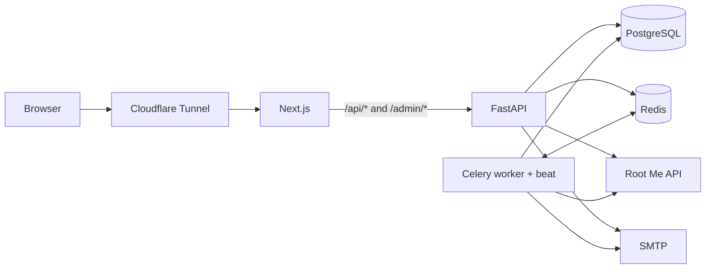

# HSLab CTF Classroom

HSLab CTF Classroom manages CTF practice across multiple Labs. Lab Leaders organize
members and semester assignments, synchronize completion data from Root Me, track
deadlines, and prepare reports for their professor. Each Lab has its own data,
platform credentials, email configuration, and automation preferences.

This README describes the implementation in this repository, including per-Lab
automation schedules, reminder review, semester-report automation, account recovery,
audit logs, and Lab export/backup/restore.

## Contents

- [Features and roles](#features-and-roles)
- [Architecture](#architecture)
- [Installation](#installation)
- [Configuration](#configuration)
- [Local development](#local-development)
- [Deployment](#deployment)
- [Onboarding a Lab](#onboarding-a-lab)
- [Progress and synchronization](#progress-and-synchronization)
- [Automation and email](#automation-and-email)
- [Reports](#reports)
- [Backups and Lab lifecycle](#backups-and-lab-lifecycle)
- [Checks and tests](#checks-and-tests)
- [Current limitations](#current-limitations)
- [Project layout and documentation](#project-layout-and-documentation)

## Features and roles

| Area | Available functionality |
|---|---|
| Accounts | Lab login, profile, password change, forgot/reset password, linked platform accounts, leader-assisted password reset |
| Classroom | Member management, ownership transfer, semesters, challenge creation/editing, presenter assignment, progress matrix |
| Root Me | Username-to-ID lookup, challenge-title search, detail lookup, saved connection verification, manual and scheduled sync |
| Communication | Reminder templates, pending/failed reminder review, weekly and semester reports, send history, retry/resend |
| Automation | Per-Lab reminder/report schedules, per-semester report trigger, job history, notifications, failure alerts |
| Operations | Lab creation/suspension/deletion, leader recovery, JSON exports, per-Lab backups/restores, full-database backups, audit logs, feedback |

| Role | Login | Access |
|---|---|---|
| Super Admin | `/console/login` | System console, Lab lifecycle and data operations, system job history, system audit log, feedback inbox |
| Lab Leader | `/login` | Manage their Lab's members, semesters, challenges, progress, platforms, reports, reminders, automation, settings, and exports |
| Presenter | `/login` | Read Lab classroom data and record progress manually; manage their own profile |
| Member | `/login` | Read Lab classroom data and manage their own profile |

Reports, Reminders, Automation, Audit Log, and Settings are Lab Leader-only pages.
Navigation is filtered by role; backend authorization also applies to API requests.
Presenters currently can edit progress for any member/challenge in their Lab, not
just challenges assigned to them.

Member emails are unique across the system, and each member account belongs to one
Lab. Login resolves the Lab from the email. Super Admin accounts are stored separately;
there is no Lab impersonation login. Both login types use the same cookie name, so use
separate browser profiles when working as a Super Admin and Lab member simultaneously.

## Architecture

| Component | Implementation |
|---|---|
| Frontend | Next.js 16, React 19, TypeScript, Tailwind CSS 4, Lucide icons |
| API | FastAPI, Pydantic, SQLAlchemy 2 |
| Database | PostgreSQL, Alembic migrations, Row-Level Security (RLS) |
| Background work | Celery worker with embedded beat scheduler |
| Shared infrastructure | Redis broker/result backend and Root Me rate limiter |
| Email and documents | SMTP, Jinja2 templates, ReportLab PDF, openpyxl Excel |
| Deployment | Bash scripts, PM2, Cloudflare Tunnel on Linux/WSL |



Local development connects directly to Next.js without the tunnel. Its rewrites
proxy `/api/*` and `/admin/*` to FastAPI, allowing same-origin API calls and cookies.
FastAPI also exposes `/health`, `/docs`, and `/openapi.json` on the backend port;
those paths are not included in the frontend proxy rules. `/health` is a basic
process response, not a database/Redis readiness check.

Lab requests derive tenant context from a verified JWT. Database migrations enable
and force RLS on tenant-scoped tables, including indirect scoping for progress and
reminders. Background jobs bind tenant context separately. Use a runtime database
role without superuser or `BYPASSRLS` privileges.

Passwords are bcrypt hashes. JWTs live in HTTP-only, SameSite=Lax cookies; production
mode adds Secure. Password changes/resets increment the member's token version to
invalidate earlier sessions. Platform and per-Lab SMTP credentials are encrypted at
rest with Fernet and omitted from normal API responses.

The UI uses one app-wide dark/light theme, defaulting to dark, with Manrope and
JetBrains Mono fonts. The dashboard has a collapsible sidebar, mobile navigation,
Ctrl/Cmd+K command palette, notifications, and toasts. The console shares the theme
and identifies system scope through its badges.

## Installation

The examples below target a Linux/WSL checkout using Bash. You need Python with
`venv` support, Node.js/npm compatible with the frontend's Next.js dependency
(Node.js 20.9 or newer), PostgreSQL, and Redis. PM2 and `cloudflared` are needed only
for the deployment workflow.

### 1. Create the database and start Redis

On an Ubuntu/Debian host:

```bash
sudo apt-get update
sudo apt-get install -y python3-venv postgresql postgresql-contrib redis-server
sudo service postgresql start
sudo service redis-server start
sudo -u postgres psql -c "CREATE USER hslab WITH PASSWORD '<pick-a-password>';"
sudo -u postgres psql -c "CREATE DATABASE hslab_ctf OWNER hslab;"
redis-cli ping
```

Replace the password placeholder and use the same credentials in `DATABASE_URL`.
The database creation commands are for a new installation, not an upgrade. On a
systemd-enabled host, enable PostgreSQL and Redis services if they should start
automatically after reboot.

### 2. Install dependencies

Backend, from the repository root:

```bash
cd backend
python3 -m venv venv
source venv/bin/activate
pip install -r requirements.txt
```

Frontend, from the repository root in another terminal:

```bash
cd frontend
npm ci
```

### 3. Configure the application

For a new installation, copy the template from the repository root:

```bash
cp .env.example .env
```

Edit `.env` using the reference below. Do not replace an existing deployment's `.env`
with the template. The backend reads this root file regardless of its working
directory; deployment scripts also source it as Bash, so quote values containing
spaces or shell metacharacters. Keep `.env` private and untracked.

Generate separate signing and encryption keys in the activated backend environment:

```bash
python -c "import secrets; print(secrets.token_hex(32))"
python -c "from cryptography.fernet import Fernet; print(Fernet.generate_key().decode())"
```

Use the first output for `JWT_SECRET_KEY` and the second for `PLATFORM_SECRET_KEY`.
Preserve the encryption key securely: changing or losing it makes saved platform and
SMTP credentials unreadable until they are re-entered.

### 4. Apply migrations and bootstrap Super Admin

From the repository root:

```bash
cd backend
source venv/bin/activate
alembic upgrade head
python -m app.seed_super_admin
```

Set `SUPER_ADMIN_BOOTSTRAP_EMAIL` and `SUPER_ADMIN_BOOTSTRAP_PASSWORD` first. The
bootstrap creates the account only if that email does not already exist; rerunning
it does not reset an existing password. Member self-service password recovery does
not apply to Super Admin accounts.

## Configuration

The definitive settings are in [backend/app/core/config.py](backend/app/core/config.py).
[.env.example](.env.example) is a starting template; it still includes legacy schedule
keys and does not list every current setting.

| Setting | Purpose / default |
|---|---|
| `APP_ENV` | `development` for local HTTP; `production` for deployed HTTPS and Secure cookies |
| `BACKEND_PORT`, `FRONTEND_PORT` | Script ports; default `8000` and `3000` |
| `DATABASE_URL` | PostgreSQL runtime connection; replace template credentials |
| `JWT_SECRET_KEY`, `JWT_ALGORITHM` | Token signing secret and algorithm (`HS256`) |
| `ACCESS_TOKEN_EXPIRE_MINUTES` | JWT lifetime, default `720`; cookie max-age is currently fixed at 12 hours |
| `CORS_ORIGINS` | Comma-separated allowed browser origins; default `http://localhost:3000` |
| `PUBLIC_APP_URL` | Browser-facing origin for password-reset links; default `http://localhost:3000` |
| `PASSWORD_RESET_TOKEN_EXPIRE_MINUTES` | Reset-token lifetime, default `30`; tokens are hashed and single-use |
| `SUPER_ADMIN_BOOTSTRAP_EMAIL`, `SUPER_ADMIN_BOOTSTRAP_PASSWORD` | Initial system account |
| `PLATFORM_SECRET_KEY` | Fernet key for platform and per-Lab SMTP credentials |
| `REDIS_URL` | Broker, task results, rate limiter; default `redis://localhost:6379/0` |
| `SYNC_INTERVAL_MINUTES` | System-wide scheduled sync interval, default `1440` |
| `ROOTME_RATE_LIMIT_CAPACITY` | Shared token-bucket capacity, default `5` |
| `ROOTME_RATE_LIMIT_REFILL_PER_SECOND` | Refill rate, default `1.0`; application tuning, not a guaranteed upstream quota |
| `RATE_LIMIT_ACQUIRE_TIMEOUT_SECONDS` | Wait for an API slot, default `30` |
| `AUTOMATION_DISPATCH_INTERVAL_SECONDS` | Poll per-Lab schedules, default `300`; add to `.env` to override |
| `DEFAULT_SMTP_HOST`, `DEFAULT_SMTP_PORT` | System SMTP fallback; port defaults to `587` |
| `DEFAULT_SMTP_USERNAME`, `DEFAULT_SMTP_PASSWORD`, `DEFAULT_SMTP_FROM_ADDRESS`, `DEFAULT_SMTP_USE_TLS` | System email credentials/sender; TLS defaults to `true` |
| `BACKUP_DATABASE_URL` | Separate read-only, `BYPASSRLS` connection for full-database dumps |
| `BACKUP_DIR` | Default `./backups`; use an absolute path to avoid different resolution between backup implementations |
| `BACKUP_RETENTION_COUNT`, `BACKUP_HOUR_UTC` | Keep latest `14` full dumps; schedule at `03:00 UTC` |
| `ALERT_FAILURE_THRESHOLD` | Consecutive recorded failures before system email alert, default `3` |
| `CLOUDFLARE_TUNNEL_TOKEN` | Empty for Quick Tunnel; set for Named Tunnel |

`REMINDER_CHECK_HOUR_UTC`, `WEEKLY_REPORT_DAY_OF_WEEK`, and
`WEEKLY_REPORT_HOUR_UTC` are legacy, unused settings. Configure repeating reminder
and weekly-report schedules in **Settings → Automation**, and semester-report
automation on **Semesters**. All automation schedule times are UTC.

## Local development

Keep PostgreSQL and Redis running. Redis is also required for manual Root Me API
operations, even when no Celery worker is running.

Start each process in its own terminal, initially at the repository root:

```bash
# Terminal 1: API
cd backend
source venv/bin/activate
uvicorn app.main:app --reload --port 8000
```

```bash
# Terminal 2: frontend
cd frontend
npm run dev -- --port 3000
```

```bash
# Terminal 3: background jobs and scheduler
cd backend
source venv/bin/activate
celery -A app.celery_app worker -B --loglevel=info
```

Open `http://localhost:3000`; use `/console/login` for initial Lab creation.
API documentation is at `http://localhost:8000/docs`.

For custom ports, adjust the commands and export `BACKEND_PORT` in the frontend
terminal so Next.js proxies to the correct API port; it does not automatically load
the repository-root `.env`. Use `APP_ENV=development` for local HTTP. Do not run a
second beat scheduler against the same deployment while the PM2-managed worker
with `-B` is active.

## Deployment

Install PM2 (`npm install -g pm2`) and make the `cloudflared` executable available
on the host. The included scripts expect the virtual environment at `backend/venv`.

Build from the repository root, loading the same configuration used at runtime:

```bash
set -a
source .env
set +a
cd frontend
npm run build
cd ..
pm2 start ecosystem.config.js
pm2 save
```

Loading `.env` before the build matters when `BACKEND_PORT` differs from `8000`,
because Next.js evaluates its proxy configuration during the build. The build also
uses `next/font/google` to fetch the configured fonts.

| PM2 process | What it runs |
|---|---|
| `hslab-app` | FastAPI and Next.js together; if either exits, the wrapper stops the other so PM2 can restart the stack |
| `hslab-celery` | Celery worker with embedded beat: sync, automation dispatch, full-database backups |
| `hslab-tunnel` | Cloudflare Tunnel pointing to the frontend |

This host may run unrelated PM2 applications. **Always target exact process names;
never use `pm2 stop all`, `pm2 restart all`, `pm2 delete all`, or `pm2 kill`.**

```bash
pm2 list
pm2 logs hslab-app
pm2 logs hslab-celery
pm2 logs hslab-tunnel
```

For updates, install changed dependencies, apply migrations, and rebuild the
frontend before restarting affected processes. For migrations requiring downtime,
stop `hslab-app` and `hslab-celery` first and take a verified backup. After updating
application configuration or code:

```bash
pm2 restart hslab-app
pm2 restart hslab-celery
```

Restart `hslab-tunnel` only when its configuration needs to change. The scripts read
the root `.env` on startup. For reboot recovery, run `pm2 startup`, follow the
command it prints, and run `pm2 save`. On WSL, verify that systemd is enabled before
using this startup integration; the repository cannot configure it for the host.

### Public URL

With an empty tunnel token, the script starts a Quick Tunnel. Retrieve the latest
URL from its log:

```bash
./scripts/get-tunnel-url.sh
```

The Quick Tunnel URL can change when the tunnel restarts. Update `PUBLIC_APP_URL`
and the applicable `CORS_ORIGINS` entry, then restart the app and worker so generated
password-reset links use the current public address.

For a Named Tunnel, configure its public hostname to route to the frontend service
(normally `http://localhost:3000`), set `CLOUDFLARE_TUNNEL_TOKEN` in `.env`, and run
`pm2 restart hslab-tunnel`. Use the public HTTPS origin for `PUBLIC_APP_URL` and set
`APP_ENV=production` for HTTPS deployment in either tunnel mode. The app script binds
both servers to `0.0.0.0`; restrict direct access to their ports through host/network
configuration when the tunnel is intended to be the public entry point.

## Onboarding a Lab

1. Sign in at `/console/login`, then create a Lab with its name, slug, and first
   Lab Leader account. Creation seeds an active Root Me platform marked as focus,
   initially without credentials.
2. Sign in as the Lab Leader at `/login`. Change the initial password on **Profile**.
3. Open **Platforms**, save the Root Me API key, and run **Test Connection**. A
   successful test stores a verification timestamp. Switching focus requires an
   active, verified platform.
4. Add members and their platform accounts. Each linked account needs its external
   user ID; username lookup helps resolve the Root Me ID. Members can also edit
   their own linked accounts from Profile.
5. Create a semester and mark it current. Review its report trigger date and
   auto-send preference.
6. Add challenges with semester, platform, week, deadline, points, and optional
   presenter. Search Root Me by title, choose a result, then use **Fetch by ID** to
   fill points, category name, and webpage URL. Review the fields before saving.
7. Configure **Settings → SMTP**, send a test email, and save the professor's
   address. A Lab without its own SMTP uses the system fallback when configured.
8. Review automation schedules and auto-send switches. Generate/sync manually to
   inspect initial results, then use **Automation**, **Reminders**, and **Reports**
   to follow subsequent work.

## Progress and synchronization

The adapter registry currently implements only `rootme`. The model supports multiple
platform records; another platform type requires an adapter and registration in
[backend/app/adapters/registry.py](backend/app/adapters/registry.py).

Sync compares Root Me completion timestamps with each assigned challenge's deadline:

| Status | Automatic classification |
|---|---|
| `early` | Completed at least 48 hours before the deadline |
| `done` | Completed by the deadline, after the early cutoff |
| `late` | Completed after the deadline |
| `missing` | Explicit missing entry; absent progress is also treated as missing in the matrix/reports |

There is no separate stored `not_started` status. Sync only creates/updates entries
for detected completions; it does not populate missing rows for every assignment.
The adapter interprets Root Me timestamps as Europe/Paris local time and converts
them to UTC, including daylight-saving changes.

Manual progress takes precedence over sync. Existing `done` entries are skipped;
other manual entries are retained and can receive a `[sync conflict]` note. The
scheduled path processes linked active members on each active Lab's active focus
platform, with separate member tasks and a combined `SyncLog`. A focus platform
without credentials is recorded as `skipped_not_configured`.

Manual **Sync now** runs synchronously in the API request, with a 15-minute cooldown
based on the last sync log for that Lab/platform. Both manual and scheduled requests
use the shared Redis rate limiter, and the adapter retries network/429 failures.
Scheduled sync cadence is global, independent of per-Lab reminder/report schedules.

Changing focus does not rewrite existing challenge associations. Sync currently
looks across all challenges linked to the selected platform, not only the current
semester. See the duplicate-association limitation below before reusing the same
Root Me challenge in multiple assignments.

## Automation and email

Celery beat has three entries: scheduled sync, per-Lab automation dispatch, and
full-database backup. The dispatcher checks active Labs every 300 seconds by default;
a due task runs on a subsequent tick, not necessarily at the exact scheduled second.

### Per-Lab schedules

Settings supports never/daily/weekly/biweekly/monthly/custom-interval schedules for
reminders and weekly-report generation, with independent enable and auto-send flags.
Weekdays use Monday=0 through Sunday=6. Monthly dates beyond a month's last day are
clamped to that last day. Custom intervals run every N days from their anchor.

Defaults are daily reminders at 06:00 UTC with auto-send enabled, and weekly report
generation on Monday at 00:00 UTC with auto-send disabled. Settings are stored in
the database; their initial anchor is creation time, so a new schedule does not
immediately replay an earlier slot.

Each semester has its own one-time report trigger date, defaulting to its end date
when created. Semester automation defaults to enabled and auto-send to disabled.
Once its automated trigger has fired, changing the date does not re-arm it; manual
report generation remains available.

### Reminders

The service checks T-3 and T-1 milestones for active members whose progress is absent,
`missing`, or `late`. Each member/challenge/milestone has a unique reminder record
to avoid regenerating an existing reminder.

With auto-send off, reminders appear on `/dashboard/reminders`. Lab Leaders can
edit the subject/body, send a pending reminder, retry a failed send, or discard it.
Discard deletes the record; a later run can recreate it if the condition still
applies. The current service also considers milestones on overdue challenges.

Customize the default subject and body under Settings using these placeholders:
`{{ member_name }}`, `{{ challenge_title }}`, `{{ deadline }}`, `{{ days_left }}`,
and `{{ milestone }}`. Pending reminders keep the text captured when generated;
editing the template does not rewrite their content.

### Monitoring and manual actions

**Automation** shows the latest 100 sync runs and 100 other Lab job runs, including
sync update/conflict counts and errors. It offers retries for sync, reminders, and
weekly-report generation. Reminder retries respect review/auto-send preferences;
weekly-report retries generate a report without automatically sending it.

Lab Leader notifications are persisted with read/dismiss state for events such as
report readiness, reminder review, and sync errors. The frontend loads them when
the dashboard shell initializes; it does not subscribe to live updates.

Recorded failure streaks can email active Super Admins through `DEFAULT_SMTP_*`,
once at the configured threshold per streak. System backup history is available at
`/console/jobs`. Report send attempts have their own history; a successful generation
job does not by itself prove email delivery.

To queue a system-wide sync from an activated backend environment:

```bash
python -c "from app.tasks.sync_tasks import sync_all_tenants; sync_all_tenants.delay()"
```

To ask the dispatcher to check schedules immediately:

```bash
python -c "from app.tasks.automation_dispatcher import dispatch_automation; dispatch_automation.delay()"
```

Both commands require a worker and may affect all active Labs. Dispatching only
runs due schedules and can send email when auto-send is enabled. Use the Lab UI for
Lab-specific manual actions. The old `reminder_tasks.check_reminders` and
`report_tasks.generate_weekly_reports` tasks no longer exist.

## Reports

Weekly reports summarize the previous Monday–Sunday calendar week by challenge
deadline, plus the current week's early completions. The report attaches to the
current semester, or the latest semester when none is current. Its challenge query
currently spans the Lab's calendar date range, not just that attached semester.

Semester reports use that semester's challenges and group trends by assigned
`week_number`. They include member ranking, completed/late/missing counts, and
cumulative `Challenge.points`. Only `early` and `done` contribute points; late
completions are counted separately. Multiple platforms produce platform labels and
a per-platform breakdown. Historical membership is approximated by `joined_at`,
including currently inactive members who joined by the report's cutoff.

Repeated generation for the same Lab/semester/type/period refreshes an existing
draft, including generated text, and leaves an already-sent report unchanged.
Regeneration can replace manual edits to a draft.

Lab Leaders review/edit drafts on `/dashboard/reports`, then approve/send to an
explicit recipient. A failed send leaves the draft available for retry. An already
sent report can be resent with confirmation; sent reports cannot be edited or
deleted through these endpoints. Each send attempt records its recipient, outcome,
and actor. Automatic report sending uses the Lab's professor email and records
`system:auto-send`; without a professor email, the dispatcher leaves the draft unsent.

PDF/Excel export is available only for semester reports containing structured
`Report.data`. Exports render that stored snapshot, not live progress or manually
edited email text. Email sending uses report text and does not attach those export
files automatically.

## Backups and Lab lifecycle

### Full-database backups

The scheduled task runs `pg_dump -Fc` at `BACKUP_HOUR_UTC`, retains the latest
`BACKUP_RETENTION_COUNT` dumps, and records system job results. Configure
`BACKUP_DATABASE_URL` with a separate role with `BYPASSRLS` and read-only grants;
the application runtime role must remain subject to RLS.

For a new backup role, after applying application migrations:

```bash
sudo -u postgres psql -c "CREATE ROLE hslab_backup WITH LOGIN PASSWORD '<pick-a-backup-password>' BYPASSRLS;"
sudo -u postgres psql -d hslab_ctf -c "GRANT CONNECT ON DATABASE hslab_ctf TO hslab_backup;"
sudo -u postgres psql -d hslab_ctf -c "GRANT USAGE ON SCHEMA public TO hslab_backup;"
sudo -u postgres psql -d hslab_ctf -c "GRANT SELECT ON ALL TABLES IN SCHEMA public TO hslab_backup;"
sudo -u postgres psql -d hslab_ctf -c "ALTER DEFAULT PRIVILEGES FOR ROLE hslab IN SCHEMA public GRANT SELECT ON TABLES TO hslab_backup;"
```

The default-privileges grant must target the role that creates future tables
(`hslab` in this setup). Queue a backup through the worker from the repository root:

```bash
cd backend
source venv/bin/activate
python -c "from app.tasks.backup_tasks import run_scheduled_backup; run_scheduled_backup.delay()"
```

Keep copies outside the application host and preserve `PLATFORM_SECRET_KEY`
separately. A database dump does not include `.env` or per-Lab JSON backup files.
Full restoration requires an administrative restore role with sufficient DDL/data
privileges; the read-only backup role is not a restore role. Validate a dump in a
separate database before replacing live data, and stop the named app and worker
processes before a live restoration.

### Per-Lab export and backup

Lab Leaders can download their Lab's JSON export from Settings. Super Admins can
export or create/download server-side Lab backups from `/console/labs/[id]`.
These operations are synchronous and use the same versioned JSON bundle format.
Saved backups live under `BACKUP_DIR/tenants/<lab_id>/`; full-dump retention does
not prune these per-Lab files.

The bundle contains members, platforms and account links, semesters, challenges,
progress, reports, and selected reminder/sync/job history fields. It excludes
passwords, platform API credentials, and SMTP credentials. It also omits newer
configuration/history tables such as automation settings, notifications, audit logs,
feedback, and report send attempts. It is a selective export, not a complete tenant
snapshot.

### Restore and deletion

Super Admin restore supports creating a new Lab or overwriting an existing one.
It remaps entity IDs and skips members whose emails are used by another Lab,
returning warnings; associated records may also be skipped. Restoring a new Lab
while the source still exists therefore does not clone its accounts.

Restored accounts receive random passwords; configure working SMTP and use
forgot-password to regain access. Re-enter platform/SMTP credentials and review
automation settings after restoration. If no active Lab Leader remains, Super Admin
can create a new leader through the recovery action; that action refuses to run
while an active leader already exists.

Restore currently commits in stages and does not preserve every historical field
or nested identifier. In overwrite mode, existing data is deleted and committed
before import completes. A failure can leave partial data, so preserve a separate
verified backup before using overwrite.

Lab Leaders can transfer leadership and optionally step down. Member management
protects the last active Lab Leader from deletion, deactivation, or demotion.
Super Admin can suspend/reactivate Labs, preview deletion counts, and permanently
delete a Lab by confirming its exact name. Deletion cascades through classroom
data; audit/data-job history and backup files are not automatically removed along
with the Lab. There is no recycle bin. Suspension's session limitation is below.

## Checks and tests

Frontend checks, from the repository root:

```bash
cd frontend
npm run lint
npx tsc --noEmit
npm run build
```

Backend tests use pytest and cover account workflows, tenant/RLS behavior, platform
integration, reports, automation schedules/dispatch, reminders, notifications, Lab
lifecycle, restore, and audit access. Integration tests need PostgreSQL with the
migrations and runtime-role RLS behavior applied.

Prefer a dedicated test database. To migrate and run against one, from the repository
root, replace the example connection with your test database credentials:

```bash
cd backend
source venv/bin/activate
export TEST_DATABASE_URL='postgresql://hslab:<test-password>@localhost:5432/hslab_ctf_test'
DATABASE_URL="$TEST_DATABASE_URL" alembic upgrade head
pytest -q
```

The test database must already exist. Without `TEST_DATABASE_URL`, the harness falls
back to `DATABASE_URL` from the application configuration. Database tests wrap
changes in an outer transaction with savepoints and rollback at teardown; do not
mistake that fallback for an automatically created isolated database. These commands
describe available checks, not a guarantee that a particular checkout passes them.

## Current limitations

The following behaviors matter when operating or extending the current implementation:

- Suspension blocks new Lab logins and excludes the Lab from normal scheduled
  dispatch, but existing sessions do not re-check `Tenant.is_active` on every
  request. Suspension is not immediate session revocation.
- Overview counts span all recorded Lab progress, not only the current semester,
  and do not synthesize missing member/challenge pairs.
- Reminder generation can include overdue challenges and both overdue milestones.
  Review mode is useful when checking an existing Lab's backlog.
- Sync indexes challenges by external ID per platform. Reusing one Root Me challenge
  across assignments can cause only one assignment to be synchronized.
- Verification gates an explicit focus switch, but the seeded focus platform is
  unverified; scheduled sync checks credential presence, not verification freshness.
- Email delivery and database commits are separate operations. Send history helps
  inspect outcomes but does not provide exactly-once delivery after a crash.
- Per-Lab JSON restore has the fidelity and partial-commit constraints described above.

## Project layout and documentation

```text
backend/
  app/
    api/admin/       Super Admin routes
    api/v1/          Lab-scoped routes and account workflows
    adapters/        Platform interface, registry, Root Me implementation
    core/            Settings, authentication, crypto helpers, rate limiter
    db/              SQLAlchemy sessions, RLS context, encrypted column type
    models/          Persistent data model
    schemas/         Request/response validation
    services/        Sync, reminders, reports, exports, backups, notifications, audit
    tasks/           Scheduled sync, automation dispatcher, backup task
    templates/       Email templates
  alembic/           Database migrations
  tests/             Pytest suite and transaction-based harness
frontend/
  app/               Next.js routes: login/recovery, dashboard, console
  components/        UI controls, shared layouts, schedule editor
  lib/               API client, types, member/theme/toast contexts
scripts/             App, Celery, tunnel startup and tunnel URL helper
ecosystem.config.js  Three named PM2 processes
```

| Routes | Purpose |
|---|---|
| `/` | Redirect to the applicable dashboard/console or login |
| `/login`, `/forgot-password`, `/reset-password` | Lab account access/recovery |
| `/dashboard` | Overview, sync status, report nudges |
| `/dashboard/members`, `/dashboard/profile` | Member management and self-service |
| `/dashboard/semesters`, `/dashboard/challenges`, `/dashboard/progress` | Classroom organization and progress |
| `/dashboard/platforms` | Connections, verification, focus, manual sync |
| `/dashboard/reports`, `/dashboard/reminders`, `/dashboard/automation` | Reports, reminder review, job history/retry |
| `/dashboard/settings`, `/dashboard/audit-log`, `/dashboard/feedback` | Configuration/export, audit history, feedback submission |
| `/console/login`, `/console` | Super Admin login and Lab overview |
| `/console/labs/[id]` | Lab data/lifecycle operations and leader recovery |
| `/console/jobs`, `/console/audit-log`, `/console/feedback` | System job history, audit viewer, feedback inbox |

Supporting documents:

- [Original PRD](draft/HSLab_CTF_Classroom_PRD%20%282%29.md): product context and initial design.
- [Required features](REQUIRED_FEATURES.md): later feature requirements and scope decisions.
- [User guide](guideline.md): earlier walkthrough of classroom workflows.
- [Operations guide](OPERATIONS.md): earlier operational notes and RLS background.
- [Review notes](complemtary.md): historical findings and proposed repairs.
- [Dashboard design handoff](design_handoff_dashboard_redesign/README.md): redesign assets and guidance.

These documents reflect different development stages. Older claims that reminders
have no review step, semester reports are manual-only, or per-Lab backup/deletion
is unavailable are superseded by the implementation described here. The older
full-database restore example also uses a read-only backup role; follow the
restore-role requirements above instead. Check current code before treating
historical findings as unresolved issues or completed guarantees.
